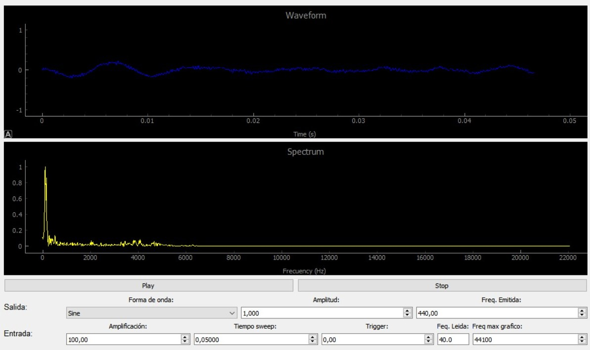

# AudioWaveExplorer

AudioWaveExplorer is an application for visualizing and analyzing audio waveforms and frequency spectrums in real-time. Experiment with different waveforms, frequencies, and amplitudes, and observe their impact on audio signals.



## Features

- Real-time audio waveform visualization
- Real-time audio frequency spectrum visualization
- Support for multiple waveform types (Sine, Sawtooth, Triangular, Square)
- Adjustable frequency, amplitude, trigger, and amplification
- Play and stop audio output
- Simple and intuitive user interface

## Installation

To install AudioWaveExplorer, clone the repository and install the required dependencies:

```sh
git clone https://github.com/yourusername/AudioWaveExplorer.git
cd AudioWaveExplorer
pip install -r requirements.txt
```

## Usage

To run AudioWaveExplorer, simply execute the `main.py` script:

```sh
python main.py
```

A graphical user interface will be displayed, allowing you to interact with the application and visualize audio signals.

## Dependencies

- Python 3
- PyQt5
- pyqtgraph
- numpy
- scipy
- sounddevice

## License

This project is licensed under the MIT License - see the [LICENSE](LICENSE) file for details.

